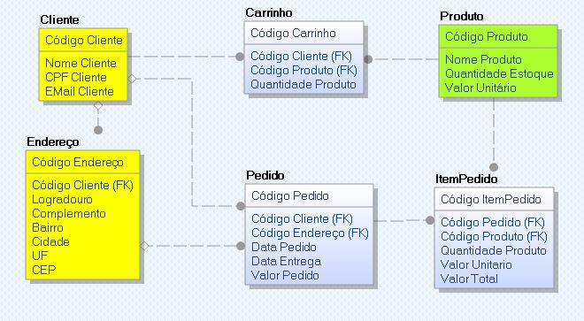

# Persistence com REDIS cache

## Repositório GIT
https://github.com/FIAP-MBA-BB/Persistence-Redis

## Integrantes:
344793 - Cassiano Bard<br>
344807 - Sandro Alves Feitosa<br>
344808 - Uillian da Silva Souza<br>
344811 - Walter Jose de Souza Filho<br>
344945 - Aldemir Robison Ribeiro

## Apresentação do projeto:
Trata-se de um sistema de cadastro de produtos e pedidos em um portal de e-commerce.
Considere os requisitos:
1) O portal possui vários produtos em estoque e com uma determinada quantidade em estoque de
cada um desses produtos.
2) Cada pedido possui um ou mais produtos e um cliente associado a esse pedido.
3) Um produto pode aparecer em um ou mais pedidos.
4) Cada produto possui um código, um nome, uma quantidade e um valor.
5) Cada cliente possui seus dados pessoais e dados de entrega.

## Modelo de Banco de Dados


Entidade Cliente — Contém os dados pessoais do cliente (Nome, CPF e EMail).

Entidade Endereço — Contém uma lista de endereços associados ao cliente.

Entidade Produto — Lista de produtos disponiveis na loja contendo quantidade em estoque e preço unitario de venda.

Entidade Carrinho — Carrinho de compras atual do cliente.

Entidade Pedido — Lista de pedidos realizados por um cliente. Contém a data do pedido, data de entrega e valor total do pedido

Entidade ItemPedido - Produtos atendidos por um determinado pedido. Contém a quantidade e o preço total unitario e total de um item.

## Documentação de referência

O projeto necessita do banco de dados REDIS executando na mesma maquina do projeto com as seguintes configurações:
```Properties
redis.host=localhost
redis.port=6379
redis.password=
```

Para o banco de dados, utilizamos o mysql hospedado em nuvem.
Este pode ser acessado através da seguinte configuração:
```Properties
database.driverClassName=com.mysql.cj.jdbc.Driver
database.url=jdbc:mysql://infone.myscriptcase.com:3306/infonem1_FIAP?serverTimezone=UTC
database.username=infonem1_FIAP
database.password=mcmiXbgCt56iNPZ
```

Documentação da API de comunicação:

```
#%RAML 1.0
---
baseUri: https://localhost:8080/spring-app

```Properties

